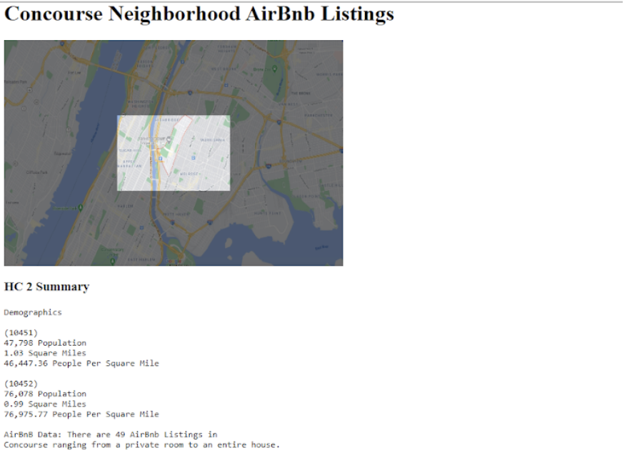
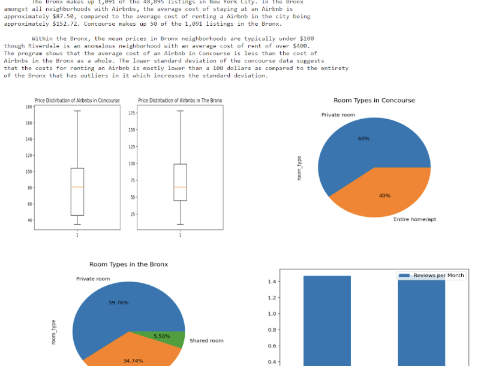
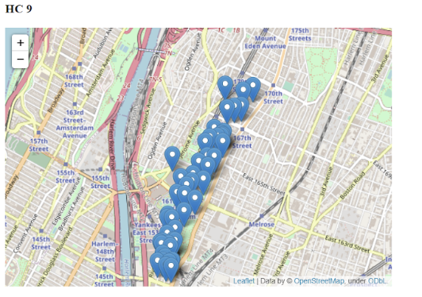

# Concourse Neighborhood Airbnb Analysis

This project summarizes Airbnb listings and neighborhood demographics for the Concourse area in the Bronx, New York City. It was originally developed as a static HTML webpage with accompanying visual summaries.

## Project Overview
- Provides demographic information for various neighborhood zip codes in Concourse.
- Summarizes Airbnb data including number of listings, pricing trends, and distribution.
- Includes neighborhood summaries (safety, transportation, attractions) for short-term rental considerations.
- Visualizes data through screenshots and interactive maps (if available).

## Features
- **Neighborhood Demographics**: Population, area, and density statistics.
- **Airbnb Data Analysis**: Listing counts, average pricing, trends, and distribution across neighborhoods.
- **Visual Summaries**: Screenshots of figures and maps representing Airbnb data and neighborhood characteristics.
- **Static HTML Presentation**: All data presented through a structured, easy-to-read webpage format.

## Screenshots
### HC2 Summary

### HC3 Summary

### HC7-8 Summary

### HC9 Map / Interactive (if available)

## Tools & Technologies
- HTML & CSS for webpage structure and styling
- Python (used for initial data analysis and figure generation)
- Matplotlib / Folium (for generating visualizations and maps)

## Notes
- Screenshots are included to preserve the original look of the webpage.
- Future updates could include live interactive maps and direct integration of visualizations.
